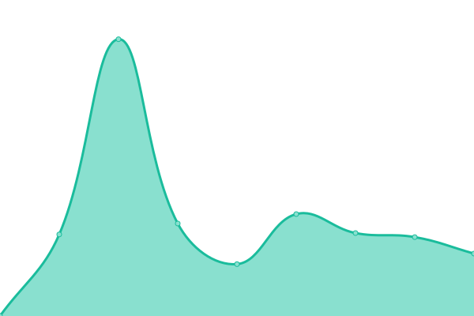
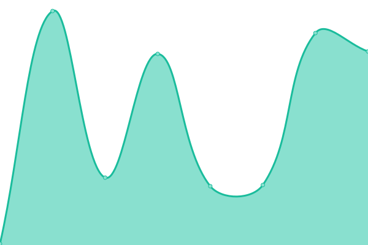

# [📈 Live Status](https://drjoeycadieux.github.io/status): <!--live status--> **🟩 All systems operational**

This repository contains the open-source uptime monitor and status page for [Joey Cadieux](https://drjoeycadieux.github.io/status), powered by [Upptime](https://github.com/upptime/upptime).

With [Upptime](https://upptime.js.org), you can get your own unlimited and free uptime monitor and status page, powered entirely by a GitHub repository. We use [Issues](https://github.com/drjoeycadieux/status/issues) as incident reports, [Actions](https://github.com/drjoeycadieux/status/actions) as uptime monitors, and [Pages](https://drjoeycadieux.github.io/status) for the status page.

<!--start: status pages-->
<!-- This summary is generated by Upptime (https://github.com/upptime/upptime) -->
<!-- Do not edit this manually, your changes will be overwritten -->
<!-- prettier-ignore -->
| URL | Status | History | Response Time | Uptime |
| --- | ------ | ------- | ------------- | ------ |
|  [Joey Cadieux](https://www.joeycadieux.dev) | 🟩 Up | [joey-cadieux.yml](https://github.com/drjoeycadieux/status/commits/HEAD/history/joey-cadieux.yml) | 

 5918ms
     
 | 

<a href="https://drjoeycadieux.github.io/status/history/joey-cadieux">97.77%</a>
    

|  [quebec-numerique](https://security-technologies.info) | 🟩 Up | [quebec-numerique.yml](https://github.com/drjoeycadieux/status/commits/HEAD/history/quebec-numerique.yml) | 

 357ms
     
 | 

<a href="https://drjoeycadieux.github.io/status/history/quebec-numerique">100.00%</a>
    

|  [Software Foundations](https://softwarefoundations.cloud) | 🟩 Up | [software-foundations.yml](https://github.com/drjoeycadieux/status/commits/HEAD/history/software-foundations.yml) | 

 817ms
     
 | 

<a href="https://drjoeycadieux.github.io/status/history/software-foundations">100.00%</a>
    

|  [Transit Montreal](https://transit-mtl.netlify.app) | 🟩 Up | [transit-montreal.yml](https://github.com/drjoeycadieux/status/commits/HEAD/history/transit-montreal.yml) | 

 227ms
     
 | 

<a href="https://drjoeycadieux.github.io/status/history/transit-montreal">100.00%</a>
    

<!--end: status pages-->

[**Visit our status website →**](https://drjoeycadieux.github.io/status)

## 📄 License

- Powered by: [Upptime](https://github.com/upptime/upptime)
- Code: [MIT](./LICENSE) © [Anand Chowdhary](https://anandchowdhary.com), supported by [Pabio](https://pabio.com)
- Data in the `./history` directory: [Open Database License](https://opendatacommons.org/licenses/odbl/1-0/)
